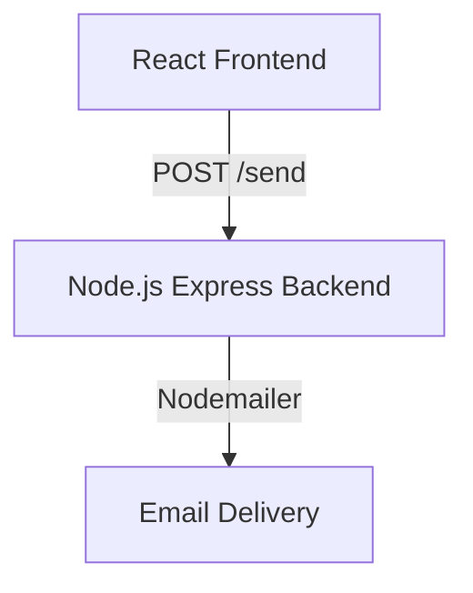
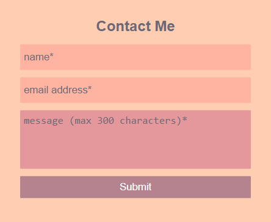
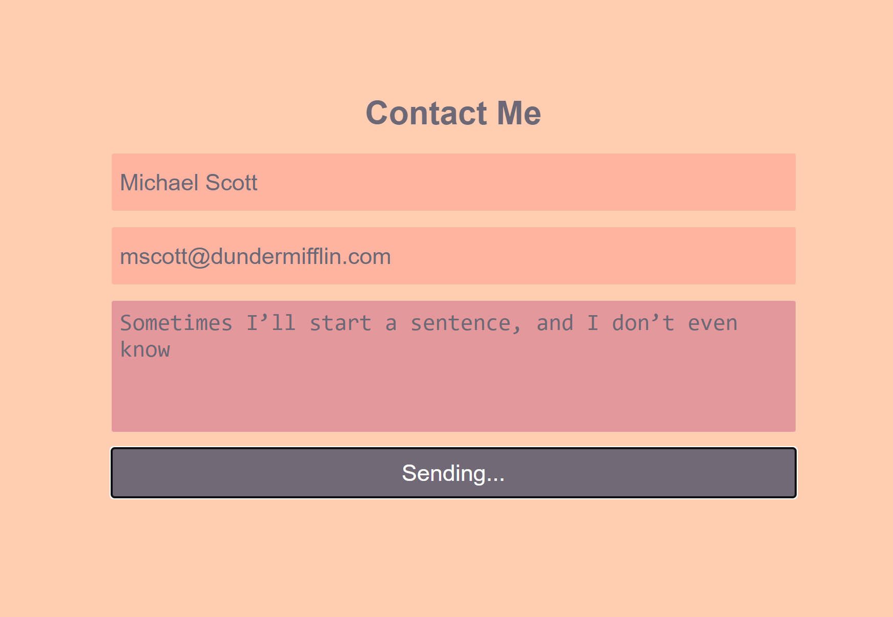
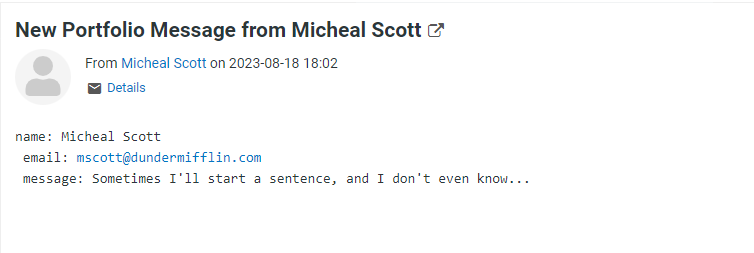

# Full-Stack Contact Form — Frontend

A React-based contact form frontend built as part of a documented full-stack project.  
Connects to a Node.js/Express backend to handle form submission and email delivery via Nodemailer.

📄 **Article Series on dev.to:**
- [Part 1 — React Frontend](https://dev.to/elenadiaz32505/part-1-full-stack-contact-form-getting-started-react-frontend-2023-1bh4)
- [Part 2 — Node.js Backend](https://dev.to/elenadiaz32505/part-2-building-a-full-stack-contact-form-nodejs-backend-2023-jdp)
- [Part 3 — Deployment](https://dev.to/elenadiaz32505/part-3-building-a-full-stack-contact-form-deployment-2023-2dj6)

🔗 **Backend Repository:** [contactform_backend](https://github.com/diazelena325/contactform_backend)

---

## Project Status

`Complete` — Built and documented as a full-stack tutorial project.

---

## Project Overview

This project demonstrates a complete client-to-server contact form implementation.  
The frontend handles form state, input validation, and API communication with the backend service.  
The project was built to document and share the full-stack process end-to-end, from UI to deployment.

---

## Features & Functionality

- Controlled form components with React state management
- Client-side input validation before submission
- REST API integration with the Node.js backend
- Success and error feedback states for the user
- Responsive layout across screen sizes

---

## Architecture



---

## Tech Stack

**Frontend**
- React
- JavaScript
- CSS
- Vite

**Communication**
- REST API
- Fetch API

---

## Engineering Notes

**Why separate frontend and backend repositories?**  
The frontend and backend are maintained as separate repositories to reflect real-world project structure, where client and server codebases are independently deployable. This also makes the tutorial series easier to follow in stages.

**Form state management**  
Controlled components were used throughout to keep form state predictable and easy to validate before submission. No external form library was introduced to keep the implementation approachable for the tutorial audience.

---

## Setup Instructions

**Clone the repository**
```bash
git clone https://github.com/diazelena325/contactform.git
cd contactform
```

**Install dependencies**
```bash
npm install
```

**Start development server**
```bash
npm start
```

> The backend service must also be running for form submission to work.  
> See [contactform_backend](https://github.com/diazelena325/contactform_backend) for backend setup.

---

## Screenshots






